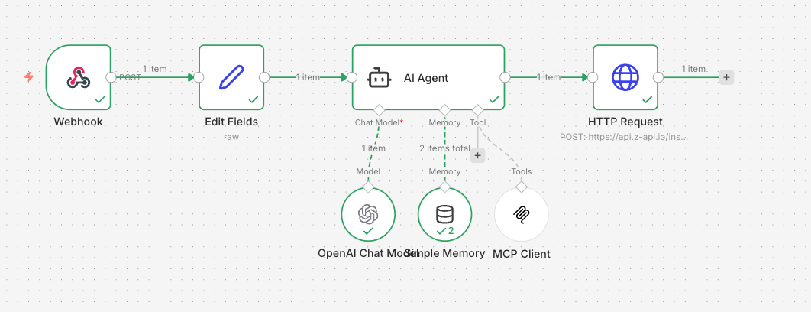
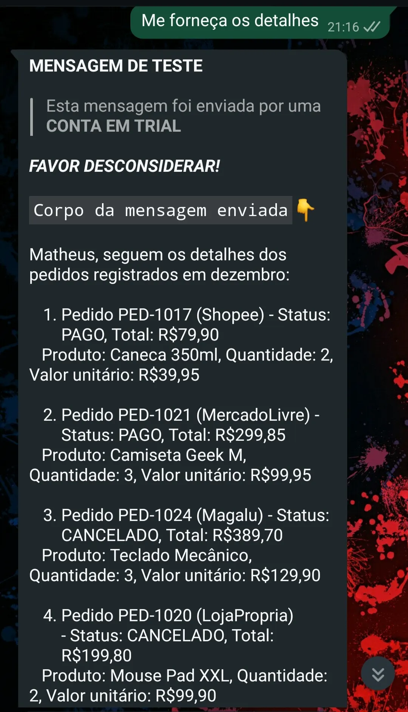
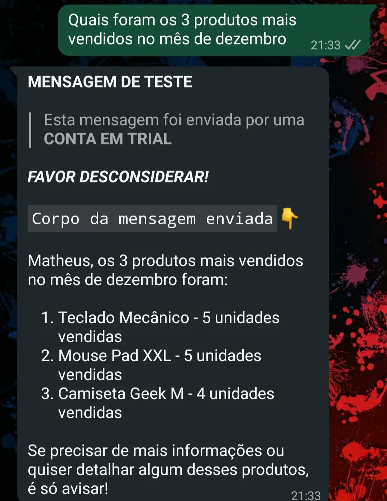

# MCP Server: Estendendo as Capacidades da IA

## **Um case prático conectando a IA ao mundo real**

<aside>
⚠️

Este texto é um estudo exploratório sobre o protocolo MCP, desenvolvido como uma prova de conceito. Trata-se de um rascunho, e algumas informações podem não refletir com total precisão o funcionamento ou as melhores práticas do protocolo.

A arquitetura apresentada é apenas para fins de prova de conceito, não sendo adequada para produção e não considerando requisitos de segurança.

</aside>

## Conceito

À medida que os modelos de Inteligência Artificial evoluem, surge a necessidade de integrá-los a sistemas externos para que possam ir além da simples geração de texto. Para que uma IA interaja com bancos de dados, APIs, sistemas internos ou ferramentas corporativas, é fundamental contar com um mecanismo de integração confiável, padronizado e seguro.

É nesse contexto que surge o **MCP Server (Model Context Protocol Server)**.

O MCP Server atua como uma **ponte entre modelos de IA e o mundo real**, permitindo que aplicações exponham funcionalidades, dados e operações de forma estruturada para serem consumidos por modelos compatíveis com o protocolo MCP.

**Em vez de criar integrações específicas para cada caso, o MCP propõe um contrato padronizado que transforma ferramentas e serviços em extensões reutilizáveis da IA.**

Na prática, o MCP Server possibilita que um modelo:

- Consulte dados em tempo real
- Execute ações em sistemas externos
- Utilize ferramentas especializadas de domínio
- Interaja com múltiplos serviços de forma orquestrada

Tudo isso mantendo **controle, segurança e previsibilidade**.

## Case

Imagine o seguinte cenário: sua empresa vende produtos online e você precisa acessar rapidamente indicadores da operação, como a quantidade de itens vendidos em um determinado período, quais produtos têm melhor desempenho ou tendências de venda. Hoje, essas informações normalmente são obtidas consultando um ERP, dashboards específicos ou solicitando dados a outros times da empresa.

Mas e se fosse possível **fazer perguntas mais específicas do seu negócio e obter insights diretamente em linguagem natural**, sem precisar navegar por múltiplos sistemas?

Com **IA + MCP**, isso se torna possível.

Onde o MCP entra nessa história? Experimente abrir um chat em uma IA generativa como o chatgpt e fazer uma pergunta específica sobre o seu negócio ou solicitar a execução de uma ação interna. O modelo, isoladamente, **não sabe onde buscar essas informações nem como executar essas operações**, porque elas vivem fora do seu contexto.

O **MCP (Model Context Protocol)** resolve exatamente esse problema. Ele é um protocolo que **estende as capacidades da IA**, permitindo que modelos interajam com dados, sistemas e operações reais. Para isso, funcionalidades de negócio são expostas como **tools (ferramentas)** por meio de um **MCP Server**, que passam a ser descobertas e utilizadas por um agente de IA — o **MCP Client**. Esse client pode ser o próprio ChatGPT, uma IDE como VS Code ou Cursor, ou até mesmo uma aplicação customizada.

### Como isso funciona na prática

De forma simplificada, o fluxo é o seguinte:

1. Você faz uma pergunta ou solicita uma ação para a IA
2. O modelo avalia se consegue responder apenas com seu conhecimento interno
3. Caso não consiga, ele consulta os MCP Servers registrados em busca de tools relevantes
4. Ao encontrar uma tool compatível com a intenção da pergunta, a IA a executa
5. O resultado é interpretado e transformado em uma resposta clara para o usuário

Esse modelo permite que a IA deixe de ser apenas uma interface conversacional e passe a atuar como um **orquestrador inteligente de operações e dados de negócio**.

Agora que você já entendeu o conceito de MCP, vamos ao **case prático**. Neste exemplo, iremos além do uso tradicional de IDEs ou chats como interface e utilizaremos algo ainda mais acessível: **o WhatsApp**. Existe uma interface mais democrática do que essa?

A proposta é simples: permitir que você **tire dúvidas sobre o seu negócio diretamente pelo WhatsApp**, usando linguagem natural, e até compartilhe esse bot com outras pessoas da empresa, sem a necessidade de acesso a sistemas internos ou dashboards.

### Arquitetura da solução

A arquitetura a seguir é **intencionalmente simplificada**, pensada apenas para fins de teste e validação do conceito (POC):

- **Z-Api**
    
    Responsável por receber e enviar mensagens via WhatsApp. Foi escolhida pela facilidade de uso, mas poderia ser substituída por qualquer outra API com a mesma finalidade.
    
- [**n8n**](https://n8n.io/)
    
    Ferramenta de automação e orquestrador de workflow. Será o responsável por orquestrar o fluxo de integração entre os componentes da solução.
    
- **OpenAI**
    
    Atua como agente de IA, responsável por interpretar a mensagem do usuário e decidir quais ações devem ser executadas.
    
- **MCP Server (AWS Lambda)**
    
    Hospeda as tools de negócio expostas via MCP. O uso de Lambda foi uma decisão voltada à simplicidade da POC e à redução de custos. Em cenários reais, o cold start torna essa abordagem menos indicada. Foi utilizado um [template](https://github.com/ran-isenberg/aws-lambda-mcp-cookbook) para configurar a infraestrutura do servidor.
    

### Fluxo de funcionamento

O fluxo da solução funciona da seguinte forma:

1. O usuário envia uma mensagem via WhatsApp
2. A mensagem é recebida pela Z-Api e encaminhada para um webhook do n8n
3. O n8n orquestra a comunicação entre a IA e o MCP Server
4. A IA utiliza as tools expostas pelo MCP Server para obter dados ou executar ações de negócio
5. A resposta final é enviada de volta ao usuário pelo WhatsApp

workflow n8n

### MCP Server

O **MCP Server** não tem nenhum mistério. Ele é, essencialmente, uma aplicação comum — neste caso, escrita em **Python** — que encapsula funcionalidades de negócio e as expõe como **tools** por meio do framework **FastMCP**. A exposição dessas funcionalidades acontece de forma declarativa, utilizando o decorator `@mcp.tool`, que torna essas operações descobríveis por um **MCP Client**. Por exemplo:

Para o cenário, o MCP Server irá expor duas tools principais:

`query_ecommerce`

Essa tool é responsável por realizar consultas no banco de dados de pedidos do e-commerce. Para a POC, foi utilizado um **DynamoDB** contendo dados fictícios, simulando informações como pedidos, produtos vendidos, valores e datas. 

`calculate_price`

Essa tool encapsula uma regra de negócio do cálculo do preço de venda de um produto para o e-commerce. A lógica pode considerar fatores como custo, margem, taxas ou descontos e diferentes canais de venda. 

## Demo

Para evidenciar o valor do MCP Server, o primeiro passo é observar o comportamento da solução **sem** o uso do protocolo, desabilitando a integração com o MCP Server no workflow:

Nesse cenário, a IA se limita a consultar apenas sua base de conhecimento interna. Como ela não possui acesso aos dados reais do negócio nem às regras específicas da operação, as respostas acabam sendo **genéricas, imprecisas ou simplesmente incorretas** para o contexto desejado.

Agora habilitando o MCP Server, irá consultar minha tool de `query_ecommerce`:

Diante da mesma pergunta, a IA identifica que precisa de informações externas e consulta a tool apropriada exposta pelo MCP Server.

Nesse momento, a IA:

1. Reconhece a intenção da pergunta
2. Seleciona a tool adequada (`query_ecommerce`)
3. Executa a consulta no banco de dados de pedidos
4. Interpreta o resultado e retorna uma resposta contextualizada

O resultado é uma resposta **precisa, baseada em dados reais do negócio**, entregue diretamente através do WhatsApp.

> O MCP Server demonstra, na prática, como a Inteligência Artificial pode ir além da conversa e passar a interagir de forma real com dados e regras de negócio.
> 

## Diferentes possibilidades de integração

Esse estudo também abrangiu [integração com a **Amazon Alexa,**](https://gist.github.com/nitefood/e2813b900692f0ec3ed1c42e3c3a6767) conforme o fluxo n8n abaixo, permitindo fazer perguntas a respeito do preço de passagens aéreas por meio de um MCP Server fictício de comparação de preços de passagens.

No entanto, até o momento, essa integração não se mostrou efetiva. O webhook da Alexa impõe um timeout de aproximadamente 10 segundos, o que não foi suficiente para completar todo o fluxo — desde o acionamento do workflow no n8n até a execução do MCP Server. 

Esse tempo excedido está diretamente relacionado à arquitetura simplificada adotada na POC, especialmente ao cold start do MCP Server hospedado em AWS Lambda.

Apesar de o workflow executar com sucesso, a Alexa não recebeu uma resposta em tempo hábil.

Essa integração e arquitetura serão revistas.

Input Alexa

Output Alexa

Interação com Alexa

